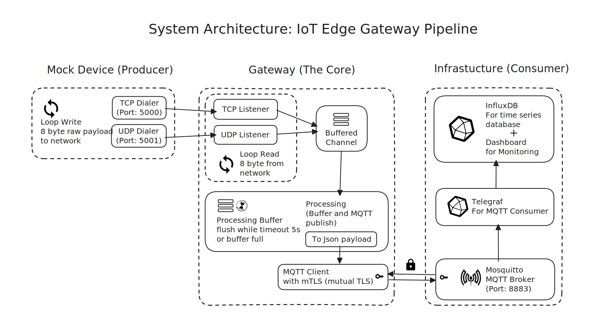
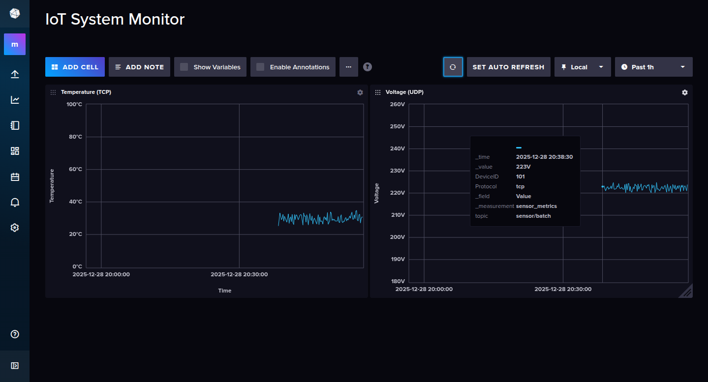

# **IoT Gateway & Simulator**

A high-performance, end-to-end IoT simulation system featuring a **Multi-protocol Gateway** and a **Device Simulator**. This project demonstrates modern Go patterns, secure communication, and automated infrastructure provisioning.

**⚠️ WARNING: FOR LOCAL DEMO ONLY**

---

## **🏛️ System Architecture**

The system follows a modern IoT telemetry pipeline:



1. **Simulator:** Generates mock sensor data (Temperature/Voltage).
2. **Gateway:** Ingests data via TCP/UDP listeners.
3. **Broker:** Eclipse Mosquitto handles message distribution.
4. **Time-Series Stack:** Telegraf consumes MQTT data and persists it to InfluxDB.

---

## **✨ Key Features**

- **Multi-Protocol Ingestion:** Concurrent **TCP** and **UDP** listeners for diverse sensor simulations.
- **Buffered Processing:** Implements internal batching to optimize network throughput and reduce broker overhead.
- **End-to-End Security:** Strict **mTLS (Mutual TLS)** implementation between the Gateway and MQTT Broker for encrypted, authenticated communication.
- **Automated Provisioning:** Zero-config dashboard setup using InfluxDB Templates and shell automation.
- **Advanced Concurrency:** Controlled lifecycle management using `context.Context` and `sync.WaitGroup` to ensure Graceful Shutdown and prevent goroutine leaks.
- **Production-Ready Structure:** Clean Architecture following the standard Go project layout.

---

## **📂 Directory Structure**

```text
├── cmd/                # Entry points for Gateway and Simulator
├── internal/           # Private business logic (Ingestion, Processing, Transport)
├── pkg/                # Public shared models
├── infra/              # Infrastructure configs (Mosquitto, Telegraf, InfluxDB)
├── gateway-certs/      # mTLS Client certificates
├── bin/                # Compiled binaries
├── logs/               # Application runtime logs
└── Makefile            # Orchestration and automation
```

---

## **🎛️ Configuration**

This project uses environment variables for flexible configuration. All necessary variables are provided with ready-to-use default values.

**First Step:** Before running, copy the example file `.env.example` to `.env`. This command is safe to run even if the `.env` file already exists.

```bash
cp .env.example .env
```

The `.env` file is ignored by Git, making it a safe place to store local configurations or secrets. For this demo, you **do not need to change** the contents of the `.env` file as the defaults are suitable for local execution.

The following table explains each variable if you wish to customize them:

| Variable              | Description                                                          | Default                |
| :-------------------- | :------------------------------------------------------------------- | :--------------------- |
| `INFLUX_TOKEN`        | Secret token for InfluxDB and Telegraf authentication.               | (provided)             |
| `GATEWAY_TCP_ADDR`    | The TCP address the Gateway listens on.                              | `:5000`                |
| `GATEWAY_UDP_ADDR`    | The UDP address the Gateway listens on.                              | `:5001`                |
| `MQTT_BROKER_ADDR`    | The address of the Mosquitto broker (in Docker) for the Gateway to connect to. | `ssl://localhost:8883` |
| `SIM_TARGET_TCP_ADDR` | The Gateway's TCP address targeted by the Simulator.                 | `localhost:5000`       |
| `SIM_TARGET_UDP_ADDR` | The Gateway's UDP address targeted by the Simulator.

---

## **📊 Dashboard Preview**

The system includes a pre-configured InfluxDB dashboard to monitor sensor metrics in real-time.



- InfluxDB Dashboard : http://localhost:8086
- Username : admin
- Password : adminpassword

---

## **🔧 Prerequisites**

- **Go** (v1.22 or higher)
- **Docker** & **Docker Compose**
- **Make** (Standard on Linux/WSL)

---

## **🚀 Quick Start**

**1. Clone the Repository**

```bash
  git clone https://github.com/Nuryanto19/iot-gateway-sim.git
  cd iot-gateway-sim
```

**2. Generate Secure Certificates (mTLS)** Initialize the Certificate Authority and generate keys for both the Broker and the Gateway.

```bash
chmod +x generate-certs.sh
./generate-certs.sh
```

**3. Run the Entire Stack** Build the Go binaries, spin up the Docker infrastructure, and start the services in the background.

```bash
make run
```

**4. Operations & Monitoring**

- **Check System Health:** `make stats` (Verify PIDs and Container status)
- **View Real-time Logs:** `make logs`
- **Stop Everything:** `make stop`

**5. Access InfluxDB**
Navigate to `http://localhost:8086`. The dashboard is automatically provisioned upon startup via `infra/influxdb/provisioning/init.sh`.

---

## **🎛️ Makefile Reference**

| **Command**             | **Action**                                              |
| :---------------------- | :------------------------------------------------------ |
| `make all` / `make run` | Build binaries, start infra, and launch apps.           |
| `make build`            | Compile Go source code into bin/.                       |
| `make start-infra`      | Launch Docker containers (Mosquitto, Influx, Telegraf). |
| `make stats`            | Display health status of Go processes and Docker.       |
| `make logs`             | Tail logs for both Gateway and Simulator.               |
| `make clean`            | Remove binaries, PIDs, and log files.                   |
| `make help`             | Showing available command                               |

---

## **📄 License**

This project is licensed under the **MIT License**.
